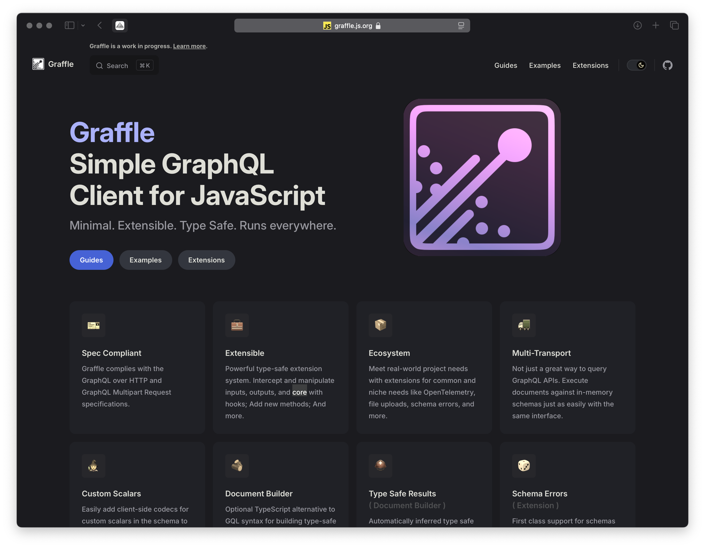
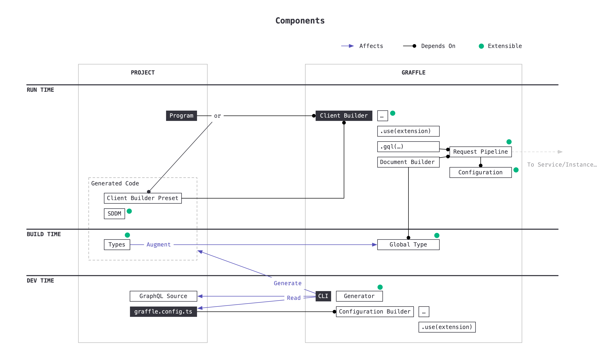

# Hello Graffle!

<br>

## A Modular Type Safe GraphQL Client

---

# What is it?

- A TypeScript library for sending GraphQL requests
- `npm add graffle@next`
- Inspirations include Genql and Prisma
- What makes it special:
  - Document builder supporting all of GraphQL
  - Focus on type safety
  - Modular (e.g. transports)



---

```yaml
layout: statement
```

# Demo Time

<br>

<a class="emoji-link" href="cursor://file//Users/jasonkuhrt/projects/graffle/tech-talk-2024-11/demos/1-gql.ts"><fxemoji-goat /></a>

---

```yaml
layout: image
title: Components Overview
```

<style>
#slide-container:has(.slidev-page-6:not([style*="display: none"])) {
  background: black!important;
}
#slideshow:has(.slidev-page-6:not([style*="display: none"])) {
	background: black!important;

  .slidev-layout {
    padding: 0!important;
    margin: 0!important;
  }
}

</style>



---

```yaml
layout: two-cols-header
```

# Is it <strike>done</strike> production ready?

- No (but maybe good enough for you?)
- Continuous pre-releases: `pnpm add graffle@next`
- 500+ tests: unit (type & value level) + E2E
- Bug fixes prioritized (closed in single digit days)

::left::

## Stable (ish)

- Raw interface
- Document builder interface
- Request pipeline
- Custom Scalars

::right::

## Unstable (ish)

- Extension System
- Extensions
- Output configuration
- CLI

---

<style>
.local .slidev-code {
  font-size: 1.8rem;
}
</style>
<div class="local">

# What's Next?

```
* chore(docs)            : Better documentation (Website, JSDoc)
* refactor               : Extract anyware package
* feat(request)          : OneOf, @defer, @stream, subscription
* improve(types)         : Simplify _appearance of_ public interface types
* feat(extension/*)      : More: Effect, Cache, BatchRequest ...
* feat                   : Automated Clients: @graffle/client-github | shopify | cloudflare-queues | yelp
* feat(extension-system) : Extensible directives
```

</div>

---

```yaml
layout: statement
```

# Thanks!

https://graffle.js.org

https://bsky.app/profile/kuhrt.me
